# HEIG Odyssey - Kick-off

## 1. Description du projet

### Problématique

Les jeux Pokémon mettent fortement l'accent sur l'aventure, l'exploration, la collection et la campagne. La tactique existe, mais elle n'est souvent pas centrale : une grande partie du jeu peut être terminée sans réellement exploiter la composition d'équipe, les types, les changements de créature ou la gestion du risque.

À l'inverse, Pokémon Showdown place le combat stratégique au premier plan. Le joueur peut créer une équipe et affronter immédiatement des stratégies variées, mais cette expérience ne propose ni aventure, ni progression persistante, ni découverte d'un univers.

| Expérience existante | Point fort | Limite pour le public visé |
|---|---|---|
| Jeu Pokémon d'aventure | Monde, collection, progression et identité des adversaires. | Peu d'espace pour apprendre ou tester la tactique de manière ciblée. |
| Pokémon Showdown | Profondeur stratégique et composition d'équipe. | Pas de campagne, de progression personnelle ni de mise en scène. |

HEIG Odyssey doit réunir **l'aventure d'un jeu Pokémon** et **la profondeur tactique d'un jeu de combat compétitif**, sans imposer de JcJ ni de microtransactions. Le joueur doit pouvoir avancer dans une campagne scénarisée, mais aussi entraîner volontairement son équipe et mesurer l'impact de ses choix tactiques.

**Décision de cadrage :** le MVP utilise les règles de combat de la **Génération 4**. Pokémon a fait évoluer ses règles au fil des générations : les attaques disponibles, les objets, le calcul des dégâts et certains effets ne fonctionnent pas toujours de la même manière. Choisir la Génération 4 revient à sélectionner une édition précise des règles d'un jeu de société. Le joueur n'a pas besoin de connaître ces différences pour jouer ; ce choix sert surtout à garantir que tous les combats suivent les mêmes règles et que le moteur `@pkmn/sim`, les données et les tests ne mélangent pas plusieurs versions du jeu.

**Format des combats :** Chaque camp peut posséder plusieurs créatures dans son équipe, mais une seule est active à la fois. Le joueur peut attaquer ou remplacer sa créature active pendant le combat. Ce format conserve les décisions tactiques essentielles (types, changements de créature et gestion du risque).

La réussite est observable si un nouveau joueur peut recruter sa première créature, choisir un mode de jeu, améliorer son équipe dans l'entraînement puis utiliser cette progression dans la campagne.

### Solution proposée

La solution est une application web solo et persistante. Après l'onboarding, l'accueil propose **quatre choix : deux modes de jeu et deux espaces de gestion** :

- **Mode campagne :** apporte l'aventure, les mondes, les dresseurs/Boss, les catchlines et les musiques.
- **Mode entraînement :** apporte un combat procédural, des adversaires adaptés à l'équipe du joueur et un apprentissage tactique sans bloquer la campagne.
- **Gestion d'équipe :** permet de choisir, organiser et préparer les créatures avant un combat.
- **Boutique gacha :** permet d'utiliser exclusivement la monnaie gagnée dans le jeu pour recruter de nouvelles créatures.

Les combats, l'entraînement et les quêtes donnent de l'expérience et de la monnaie virtuelle. Cette monnaie permet des tirages gacha ; elle est exclusivement gagnée dans le jeu.

| Besoin identifié | Réponse dans HEIG Odyssey | Preuve attendue dans le MVP |
|---|---|---|
| Combiner aventure et tactique | Campagne scénarisée, gestion d'équipe et combats Gen 4. | Un combat de campagne possède une identité et est préparé avec l'équipe du joueur. |
| S'entraîner de façon ciblée | Combats procéduraux avec trois niveaux d'IA. | Le joueur choisit un entraînement, reçoit des gains et peut tester une stratégie. |
| Donner une progression équitable | XP, monnaie virtuelle, quêtes et gacha sans paiement réel. | Chaque gain est enregistré et ne peut pas être attribué deux fois. |
| Rester faisable | Contenu et adversaires configurés par données ; modes sociaux hors MVP. | Ajouter un dresseur ne demande pas de modifier le moteur de combat. |

### Onboarding et accès aux modes

L'onboarding se joue une seule fois, au premier lancement après la création du compte. Il explique la boucle de jeu et donne au joueur le recrutement gratuit d'une première créature. Cette créature crée son équipe initiale ; aucun tirage gacha ni paiement n'est requis pour commencer.

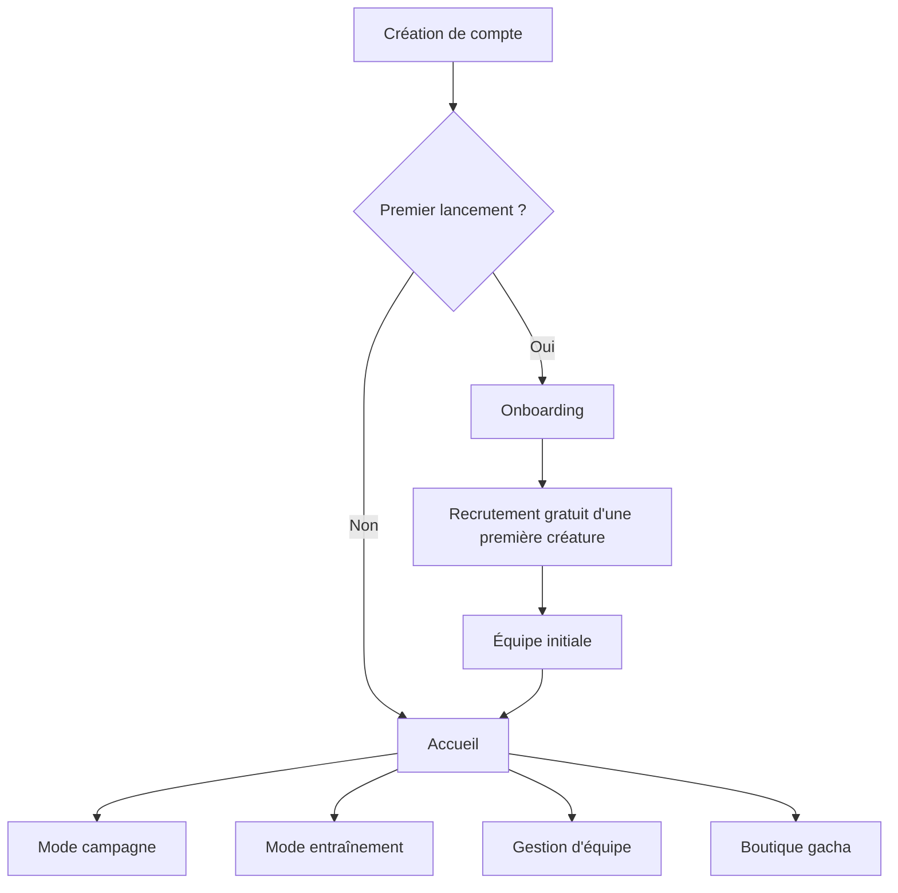

### Mode campagne

La campagne organise l'aventure en mondes et en combats progressivement débloqués. Chaque combat affiche un niveau recommandé afin d'aider le joueur à estimer sa préparation, mais cette indication reste purement informative : elle ne modifie pas les conditions de déblocage et ne bloque jamais le lancement du combat. Le joueur peut participer avec toute équipe valide composée d'une à six créatures qu'il possède, même si son équipe est moins forte que le niveau recommandé.

### Mode entraînement

L'entraînement génère un combat procédural. Il sert à gagner de l'expérience, de la monnaie et à comprendre les choix tactiques avant de retourner à la campagne.

Le niveau de l'équipe adverse est **adapté à l'équipe active du joueur**. Pour le MVP, le système calcule le niveau moyen des créatures sélectionnées et génère une équipe adverse proche de ce niveau, avec une borne minimale et maximale pour éviter les valeurs extrêmes. Par exemple, si l'équipe active possède un niveau moyen de 20, l'équipe adverse sera générée autour du niveau 20, quelle que soit la difficulté choisie.

Les trois difficultés utilisent donc une puissance d'équipe comparable : ce sont principalement les décisions de l'IA qui changent. Un joueur possédant une équipe faible peut ainsi sélectionner le niveau difficile pour affronter une stratégie plus intelligente sans rencontrer des créatures artificiellement surpuissantes. Les récompenses dépendent à la fois du niveau réel de l'adversaire et de la difficulté de l'IA : à niveau adverse égal, une victoire en difficile accorde davantage d'expérience et de monnaie qu'une victoire en facile.

| Difficulté choisie | IA adverse | Récompenses |
|---|---|---|
| Facile | Choix aléatoires (`random`). | XP et monnaie de base. |
| Normal | Heuristique : efficacité des types, PV, possibilité de KO et changement raisonnable. | XP et monnaie augmentées. |
| Difficile | Expectiminimax limité par un budget de profondeur, nœuds et temps de calcul. | XP et monnaie maximales. |

La difficulté choisie concerne exclusivement l'entraînement. Dans la campagne, chaque dresseur ou Boss possède un `aiProfile` fixe défini dans sa configuration afin de maîtriser l'équilibrage narratif.

Dans ce document, `aiProfile` désigne le comportement de l'IA associé à un adversaire : `random` choisit une action légale aléatoire, `heuristic` évalue la situation avec des règles tactiques et `expectiminimax` anticipe plusieurs résultats possibles dans un budget de calcul limité. En campagne, ce profil est imposé par la configuration du dresseur ou du Boss et ne peut pas être choisi par le joueur.

### Périmètre MVP

| Inclus dans le MVP | Hors MVP |
|---|---|
| Campagne : 5 mondes Bachelor, 2 mondes Master et 1 monde Doctorat endgame avec 5 Boss. | JcJ, classement, échanges entre joueurs et guildes. |
| Onboarding unique avec recrutement gratuit et équipe initiale. | Plusieurs tutoriels, scénarios de départ ou personnalisation avancée. |
| Entraînement procédural, trois difficultés et récompenses XP/monnaie croissantes. | Matchmaking, entraînement coopératif et recherche IA. |
| Gestion d'équipe, combats Gen 4, progression, récompenses et sauvegarde. | Choix de difficulté par le joueur dans les combats de campagne. |
| Dresseurs/Boss : `aiProfile` fixe, équipe, catchlines, musique et sprite local. | IA Expectiminimax étendue à davantage d'adversaires de campagne. |
| Gacha sans microtransactions. | Boutique payante, pass payant ou mécanisme pay-to-win. |
| Quêtes quotidiennes et hebdomadaires communes avec progression individuelle. | Application mobile native et fonctions sociales temps réel. |

### Exigences fonctionnelles (FR)

- **FR-01 - Compte et accès :** créer un compte, se connecter, vérifier son e-mail et récupérer son accès.
- **FR-02 - Onboarding :** jouer l’onboarding une seule fois, recruter gratuitement une première créature et créer l’équipe initiale.
- **FR-03 - Navigation principale :** accéder depuis l’accueil à la campagne, à l’entraînement, à la gestion d’équipe ou à la boutique gacha.
- **FR-04 - Campagne :** consulter la carte, les mondes débloqués, la progression persistante et le niveau recommandé informatif de chaque combat, puis lancer un combat disponible sans que ce niveau constitue une condition d'accès.
- **FR-05 - Gestion d’équipe :** consulter les créatures possédées, composer une équipe valide d'une à six créatures appartenant à sa collection et utiliser cette équipe dans les deux modes de combat.
- **FR-06 - Combat :** résoudre côté serveur un combat simple selon les règles Gen 4, avec une seule créature active par camp, déterminer son résultat et enregistrer celui-ci.
- **FR-07 - Entraînement :** générer une équipe adverse adaptée à l’équipe active, appliquer la difficulté d’IA choisie et calculer des gains cohérents.
- **FR-08 - Contenu de campagne :** charger les dresseurs et Boss depuis une configuration incluant leur équipe, leur `aiProfile` fixe, leurs catchlines, leur musique et la référence vers leur sprite local.
- **FR-09 - Progression et récompenses :** enregistrer l’expérience, la monnaie et les déblocages obtenus, sans attribuer deux fois le même gain.
- **FR-10 - Gacha :** effectuer un tirage sur un portail selon ses probabilités, contre de la monnaie virtuelle, puis ajouter la créature obtenue à la collection.
- **FR-11 - Quêtes :** sélectionner des quêtes quotidiennes et hebdomadaires communes, puis conserver pour chaque joueur les compteurs, statuts et récompenses associés.

### Exigences non fonctionnelles (NFR)

- **NFR-01 - Fiabilité :** les opérations qui modifient la progression sont idempotentes ; une victoire, un tirage ou une récompense ne peut pas être attribué deux fois.
- **NFR-02 - Sécurité :** les mutations de jeu et les permissions sont validées côté serveur ; les secrets ne sont jamais versionnés et aucune donnée sensible ne doit apparaître dans les logs. L'application est exposée en HTTPS, tandis que PostgreSQL et Redis ne sont pas directement accessibles depuis Internet.
- **NFR-03 - Performance :** les écrans principaux restent réactifs dans les conditions prévues pour le MVP ; les seuils mesurables sont définis dans les critères d’acceptation des issues concernées lorsque les parcours sont implémentés.
- **NFR-04 - Coût de calcul :** l’IA difficile respecte un budget configurable de temps, de profondeur et de nœuds afin de ne pas bloquer durablement le serveur.
- **NFR-05 - Maintenabilité :** le projet utilise TypeScript strict, des configurations de contenu versionnées, des migrations Prisma et des tests automatisés ciblant les règles critiques.
- **NFR-06 - Accessibilité :** les écrans principaux permettent la navigation au clavier, affichent un focus visible et fournissent des messages d’état compréhensibles.
- **NFR-07 - Exploitabilité :** l’application fournit des logs structurés, un endpoint de santé sans données sensibles et une procédure permettant de redéployer une image connue.
- **NFR-08 - Reproductibilité :** l’environnement local et l’environnement déployé reposent sur des images et configurations versionnées ; un nouveau membre doit pouvoir lancer le socle du projet à partir du dépôt et de la documentation.
- **NFR-09 - Traitement événementiel :** les événements de jeu destinés au suivi des quêtes peuvent être rejoués après une interruption sans perdre la progression et sans attribuer plusieurs fois la même récompense.
- **NFR-10 - Compatibilité :** les parcours principaux sont utilisables sur la version récente de Chromium retenue pour la démonstration, avec une interface adaptée aux tailles d'écran basiques.

Les valeurs précises qui dépendent de l’implémentation, par exemple un temps de réponse ou un budget d’IA, sont fixées dans les critères d’acceptation du Kanban au moment où la fonctionnalité concernée est préparée.

## 2. Description préliminaire de l'architecture

Next.js et TypeScript hébergent l'interface ainsi que les services de domaine. PostgreSQL constitue la source de vérité persistante, tandis que Redis fournit le cache, les verrous courts et le transport des événements. L'IA et `@pkmn/sim` sont exécutés directement dans le conteneur applicatif. Pour améliorer la lisibilité, l'architecture est présentée par vues ciblées : point d'entrée, domaines fonctionnels, moteur de combat, sprites, puis persistance et traitement des événements.

### Architecture applicative

Les diagrammes suivants représentent les mêmes composants sous différents angles. Certaines cases sont volontairement répétées afin que chaque vue puisse être comprise indépendamment.

#### Point d'entrée et authentification

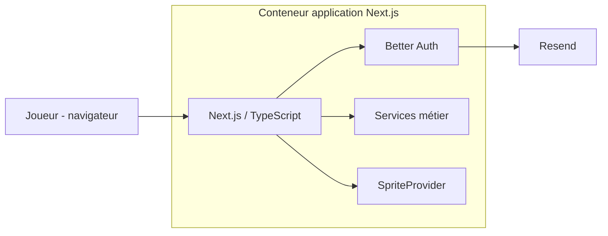

#### Domaines fonctionnels

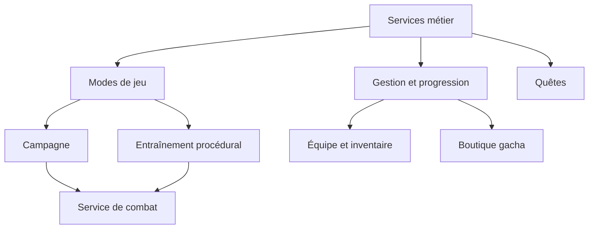

#### Moteur de combat et IA

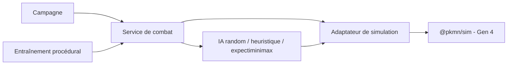

#### Import et utilisation des sprites

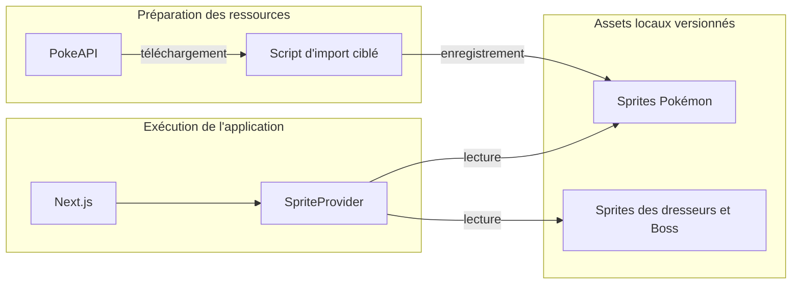

### Persistance et traitement des événements

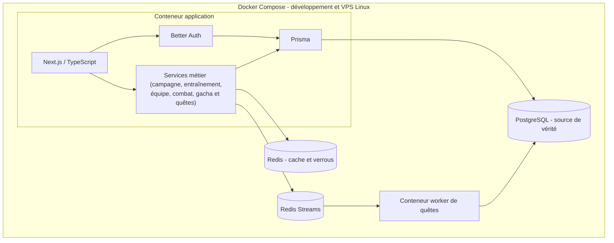

### Gestion des sprites

Les sprites des dresseurs et Boss sont locaux : ils font partie du contenu scénarisé et restent disponibles même si un service externe est indisponible.

Pour les Pokémon, un script d'import récupère les sprites des créatures réellement présentes dans le jeu (starters, gacha, équipes de campagne et entraînement), puis les enregistre localement avec un manifeste de source et de version. Pendant le jeu, le `SpriteProvider` ne renvoie que des références locales ; aucun composant ne contacte PokéAPI directement. Cette approche évite une dépendance réseau en combat et respecte la recommandation de PokéAPI de mettre en cache les ressources demandées. [Documentation PokéAPI](https://pokeapi.co/docs/v2)

### Quêtes, PostgreSQL et Redis Streams

PostgreSQL enregistre les définitions de quête, les rotations sélectionnées, les instances joueur, les résultats de combat et les récompenses. Redis Streams transmet les événements ; il ne remplace pas la source de vérité.

- Chaque jour, le serveur tire et persiste une rotation de quêtes quotidiennes commune à tous les joueurs.
- Chaque semaine, il fait de même pour les quêtes hebdomadaires.
- À la fin d'un combat de campagne ou d'entraînement, il publie `battle.completed` ou `training.completed` avec un `eventId` unique.
- Le worker met à jour les instances concernées. L'unicité de `eventId` et de l'attribution de récompense empêche les doublons.

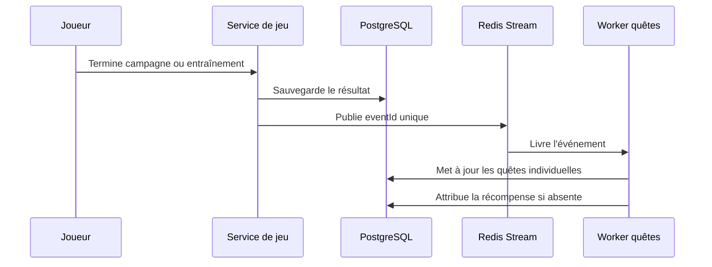

Cette architecture reste préliminaire. Les mécanismes de reprise, de concurrence et de garantie de publication sont précisés au moment de l'implémentation, à partir des comportements réellement observés et des risques rencontrés.

## 3. Choix techniques

| Besoin | Choix | Rôle | Justification face aux alternatives |
|---|---|---|---|
| Frontend | React, Next.js, TypeScript | Onboarding, accueil, campagne, entraînement, gestion d'équipe et combats. | Next.js permet de partager TypeScript, types et conventions entre l'interface et le serveur. Une SPA React accompagnée d'une API séparée offrirait plus d'indépendance, mais ajouterait un second projet et une chaîne de déploiement supplémentaire pour une équipe de quatre personnes. |
| Backend | Route Handlers / Server Actions Next.js, TypeScript, Prisma | Règles métier, validation serveur, persistance et événements. | Ce choix maintient les règles serveur proches des parcours qui les utilisent. Un service séparé tel que NestJS serait pertinent pour plusieurs clients ou équipes autonomes, mais créerait ici davantage de contrats réseau et de configuration. |
| Persistance | PostgreSQL + Prisma | Utilisateur, équipe, progression, résultats, gacha, quêtes et migrations. | Les relations et transactions conviennent à une progression cohérente et aux récompenses idempotentes. Une base NoSQL serait flexible pour le contenu, mais moins naturelle pour les contraintes relationnelles et transactionnelles du projet. |
| Authentification | Better Auth | Comptes, sessions et intégration Prisma. | Better Auth s'intègre à l'écosystème TypeScript et Prisma tout en évitant de développer nous-mêmes la gestion sensible des sessions. Une authentification entièrement maison serait plus contrôlable, mais plus risquée et coûteuse ; un fournisseur hébergé ajouterait une dépendance externe. |
| E-mail | Resend | Vérification de compte et récupération d'accès. | Resend fournit simplement les e-mails transactionnels nécessaires. Héberger et maintenir un serveur SMTP serait disproportionné pour le MVP. |
| Combat | `@pkmn/sim` configuré Gen 4 | Résolution des combats et états évalués par l'IA. | Le moteur fournit des règles déjà structurées et limite le risque d'incohérences. Réimplémenter les combats donnerait un contrôle total, mais absorberait une part trop importante des deux semaines de réalisation. |
| Sprites | PokéAPI à l'import + assets locaux | Interface indépendante d'une API externe au runtime. | L'import conserve la facilité d'accès aux ressources tout en supprimant la dépendance réseau pendant le jeu. Appeler directement PokéAPI serait plus simple au départ, mais rendrait l'expérience dépendante de sa disponibilité et de sa latence. |
| Cache / événements | Redis + Redis Streams | Cache ciblé, verrous courts et traitement asynchrone des quêtes. | Un même outil couvre les besoins temporaires et le traitement d'événements. Une solution fondée uniquement sur PostgreSQL serait plus simple à exploiter ; Redis ne sera donc utilisé que pour les cas où son apport est démontré pendant l'implémentation. |
| Tests | Vitest + Playwright + axe-core | Tests de logique, d'intégration, E2E et accessibilité. | Vitest garde les règles métier rapides à tester, tandis que Playwright et axe-core vérifient les parcours réels. Des tests uniquement E2E seraient lents et difficiles à diagnostiquer ; des tests uniquement unitaires ne couvriraient pas l'intégration navigateur. |
| Environnements | Docker + Docker Compose | Développement et déploiement reproductibles. | Les conteneurs réduisent les écarts entre les postes et le VPS. Des installations natives sont plus rapides pour un premier essai, mais augmentent les différences de versions et les étapes manuelles. |
| Livraison | GitHub, Projects, Actions et GHCR | Pilotage, CI/CD et registre d'images. | Ces services regroupent code, Kanban, automatisation et images dans un même environnement. GitLab proposerait une chaîne équivalente, mais GitHub évite de répartir le projet entre plusieurs plateformes. |

## 4. Processus de travail et outils de développement

### Organisation humaine

Le projet comporte deux sprints de réalisation d'une semaine. Un **socle CI/CD fonctionnel est mis en place dès la semaine 1** afin de démontrer le déploiement d'une modification. Pendant les deux sprints de réalisation, ce socle est enrichi avec les tests, contrôles et étapes correspondant aux fonctionnalités réellement développées ; sa version complète fait donc également partie de l'objectif final de la semaine 3.

| Sprint | Objectif de fin de semaine |
|---|---|
| Semaine 2 - Sprint 1 | Socle fonctionnel : modèle PostgreSQL initial, compte, onboarding, équipe initiale, configuration de contenu, premier combat Gen 4 et environnement local Docker Compose. Le pipeline initial est conservé et complété par les premiers tests du produit. |
| Semaine 3 - Sprint 2 | Boucle complète : campagne, entraînement adaptatif, quêtes, gacha, intégration et tests essentiels. Le pipeline CI/CD est finalisé avec les contrôles du produit complet et un déploiement final reproductible. |

Le modèle PostgreSQL initial est défini collectivement au début du Sprint 1 afin que chaque membre puisse y intégrer les données nécessaires à son domaine. Après cette validation commune, Ismael devient responsable de la cohérence du schéma Prisma, des migrations et des adaptations transversales de la base.

| Membre | Responsabilités principales | Soutien et collaboration |
|---|---|---|
| Tiago | Frontend, UI/UX, authentification et sécurité applicative. | Assistance à Evan pour l'interface de la boutique gacha. |
| Ismael | DevOps, maintien du modèle PostgreSQL après sa conception collective, quêtes, Redis et Redis Streams. | Soutien à Mo sur l'IA et coordination des besoins de données/configuration. |
| Evan | Sprites, fichiers de configuration Pokémon, gacha, taux de drop et différents portails de recrutement. | Collaboration avec Tiago pour l'intégration du gacha dans l'interface et la sécurité. |
| Mo | IA de combat, expectiminimax, génération de l'entraînement et données d'équilibrage. | Soutien DevOps avec Ismael et intégration avec l'adaptateur `@pkmn/sim`. |

La validation fonctionnelle, la revue finale, les tests transversaux et la préparation de la démonstration sont assurés collectivement par les quatre membres.

### Issue tracker et suivi

GitHub Projects est le tableau Kanban unique. Chaque issue contient un objectif, des critères d'acceptation, une priorité, un responsable et un lien vers la Pull Request concernée. La priorisation détaillée des exigences et du contenu MVP est maintenue dans ce tableau afin de pouvoir évoluer pendant la réalisation sans dupliquer cette information dans le document de cadrage.

`Backlog` → `Ready` → `In progress` → `In review` → `Done`

Une tâche est **Done** lorsque ses critères d'acceptation sont validés, les tests concernés passent, la documentation/configuration est à jour et le changement est présent sur `dev`.

### Git flow

La branche `dev` est la branche d'intégration de l'équipe et `main` reste la branche stable et déployable. Tout travail commence obligatoirement dans une branche courte créée depuis une version à jour de `dev` :

- `feature/<sujet>` pour une nouvelle fonctionnalité ou une évolution ;
- `fix/<sujet>` pour une correction.

Une branche correspond à une tâche ou à un changement cohérent. Lorsqu'elle est terminée, son auteur ouvre une Pull Request vers `dev`. La fusion exige la CI verte et au moins une revue humaine. Les Pull Requests de travail sont fusionnées avec un **merge commit**, puis leur branche est supprimée. Cette méthode conserve les commits et leurs auteurs tout en matérialisant clairement la Pull Request dans l'historique.

À la fin de chaque sprint, si `dev` est stable et que tous les checks requis sont verts, l'équipe ouvre une Pull Request de release de `dev` vers `main`. Le projet prévoit donc normalement une promotion vers `main` à la fin du Sprint 1 et une autre à la fin du Sprint 2.

#### Travail et intégration vers `dev`

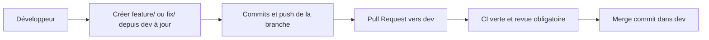

#### Promotion d'une release vers `main`

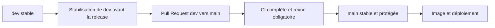

- Aucun push direct ni force-push n'est autorisé sur `dev` ou `main`.
- `dev` et `main` sont configurées comme branches protégées dans GitHub afin d'imposer les Pull Requests et les checks requis.
- Chaque branche `feature/*` ou `fix/*` est créée depuis `dev`, reste limitée à un changement cohérent et référence l'issue concernée.
- Avant la fusion, l'auteur synchronise sa branche avec `origin/dev` et y résout les conflits. Un rebase peut être effectué sur sa propre branche, mais jamais sur les branches partagées `dev` ou `main`.
- Une Pull Request vers `dev` est obligatoire. Elle demande au moins une revue humaine et tous les checks requis au vert.
- Les branches de travail sont intégrées dans `dev` avec un merge commit afin de conserver les commits individuels, leurs auteurs et la frontière de chaque Pull Request.
- Si la CI de `dev` échoue après une intégration, la correction est réalisée dans une nouvelle branche `fix/*`, puis repasse par une Pull Request.
- Seule une Pull Request `dev` vers `main` peut promouvoir une release. Elle demande une revue humaine et la CI complète au vert.
- Avant cette promotion, l'équipe suspend temporairement l'intégration de nouvelles fonctionnalités dans `dev`, termine les Pull Requests prévues pour la release et corrige les éventuels échecs dans des branches `fix/*`.

Ce workflow ajoute une étape légère de revue avant l'intégration, mais protège `dev` contre les changements incomplets et rend chaque tâche isolable. Les branches doivent rester courtes et être synchronisées régulièrement : elles ne suppriment pas les conflits, mais permettent de les résoudre avant d'affecter le travail de toute l'équipe. Les merge commits conservent le détail des contributions individuelles, tandis que les Pull Requests regroupent les changements par tâche ou fonctionnalité.

## 5. Environnements de développement et de déploiement

### Développement local

Docker Compose fournit le même socle à toute l'équipe : application Next.js, PostgreSQL et Redis. Le dépôt contient un `.env.example` sans secret, les migrations Prisma et les scripts d'import de sprites. Chaque membre peut ainsi lancer les dépendances, appliquer les migrations et exécuter les tests dans un environnement comparable.

### Déploiement

La cible est un **VPS Hostinger sous Ubuntu 24.04** avec Docker Compose. Il récupère une image depuis GHCR, charge les variables sécurisées, exécute `prisma migrate deploy` puis démarre l'application et le worker. PostgreSQL et Redis sont persistants ; une mise à jour applicative ne détruit jamais leurs données.

Seule l'application web est accessible publiquement en HTTPS. PostgreSQL et Redis ne sont pas exposés directement sur Internet : ils restent accessibles uniquement aux services autorisés à l'intérieur du réseau Docker du VPS.

Les secrets restent hors du dépôt et sont stockés dans **GitHub Actions Secrets**. Cela comprend notamment la clé SSH et les informations de connexion au VPS, `DATABASE_URL`, `REDIS_URL`, les secrets Better Auth, la clé API Resend et les identifiants nécessaires pour récupérer les images privées depuis GHCR.

## 6. Pipeline de livraison et de déploiement (CI/CD)

Le pipeline évolue avec le produit. La semaine 1 fournit un socle fonctionnel capable de vérifier, construire et déployer une modification simple. Les semaines 2 et 3 ajoutent progressivement les tests et contrôles correspondant aux fonctionnalités implémentées. Les branches de travail sont vérifiées avant leur intégration dans `dev`, puis une CI plus complète contrôle la release avant sa promotion vers `main`. La version finale garantit que le VPS reçoit exactement l'image Docker validée et identifiée par le SHA Git.

### Intégration continue (CI)

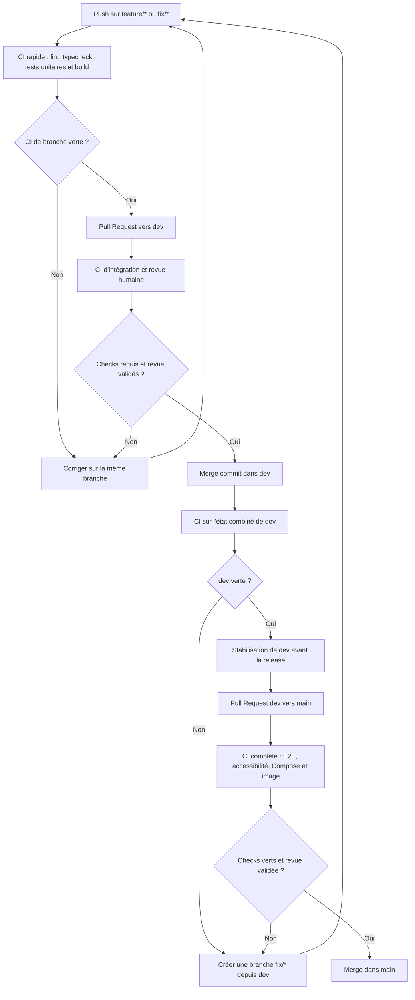

GitHub Actions écoute les pushes sur `feature/**`, `fix/**`, `dev` et `main`, ainsi que les Pull Requests ciblant `dev` ou `main`. Les jobs de publication et de déploiement restent strictement limités à une fusion dans `main`.

### Livraison et déploiement continus (CD)

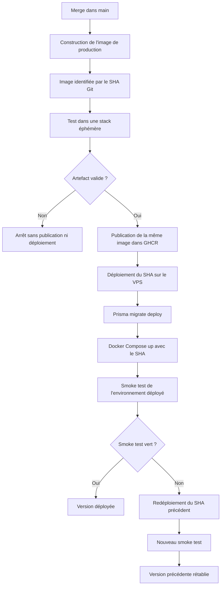

### Progression entre la semaine 1 et la version finale

| Étape du projet | Contenu du pipeline | Objectif |
|---|---|---|
| Semaine 1 - socle | Installation reproductible, lint, typecheck, premiers tests disponibles, build Next.js, construction d'une image, publication GHCR, déploiement VPS et smoke test simple. | Disposer d'une base DevOps fonctionnelle et démontrer le déploiement d'une modification. |
| Semaines 2 et 3 - enrichissement | Ajout des tests de combat, d'intégration, E2E et d'accessibilité à mesure que les parcours existent ; validation complète de l'image, migrations et rollback. | Faire évoluer le socle sans reconstruire le processus et livrer la version finale de manière reproductible. |

### Contrôles sur les branches de travail, `dev`, les Pull Requests et `main`

| Déclencheur | Contrôles ou action |
|---|---|
| Push sur `feature/**` ou `fix/**` | Installation, lint, typecheck, tests unitaires disponibles et build Next.js. Cette boucle rapide donne un retour au développeur avant la demande d'intégration. |
| Pull Request `feature/*` ou `fix/*` vers `dev` | Réexécution des contrôles rapides sur le commit de la PR, tests de combat et d'intégration disponibles, validation Docker Compose et revue humaine. La fusion est interdite tant qu'un check requis ou la revue manque. |
| Fusion dans `dev` | Vérification de l'état combiné de la branche d'intégration. En cas d'échec, aucune release n'est ouverte et la correction passe par une nouvelle branche `fix/*`. |
| Pull Request `dev` vers `main` | Réexécution de tous les contrôles précédents, E2E Chromium, accessibilité, validation Docker Compose, construction de validation de l'image et revue humaine. L'image construite ici valide le Dockerfile, mais n'est pas l'artefact de production. |
| Fusion dans `main` | Construction unique de l'image de production depuis le SHA fusionné, test de cette image avec PostgreSQL et Redis éphémères, publication de la même image dans GHCR, déploiement du SHA sur le VPS, migrations et smoke test. |

| Étape | Commande / action | Condition de passage |
|---|---|---|
| Installation | `npm ci` | Installation reproductible depuis le lockfile. |
| Lint | `npm run lint` | Aucune erreur de règles statiques ou d'import. |
| Typecheck | `npm run typecheck` (`tsc --noEmit`) | Aucune erreur TypeScript. |
| Tests unitaires | `npm run test:unit` avec Vitest | Déblocage, gacha, première recrue, gains d'entraînement et idempotence sont vérifiés lorsque ces fonctionnalités existent. |
| Tests de combat | `npm run test:combat` avec fixtures `@pkmn/sim` Gen 4 | Les résultats de scénarios figés et les invariants métier sont vérifiés. |
| Tests d'intégration | `npm run test:integration` avec PostgreSQL/Redis réels éphémères | Transactions Prisma, migrations, Streams et événements rejoués sont testés sans mocks. |
| Build | `npm run build` | L'application de production Next.js est générée sans erreur. |
| E2E | `npm run test:e2e -- --project=chromium` | Onboarding, accueil à quatre choix, entraînement, campagne, gestion d'équipe et boutique gacha fonctionnent dans un navigateur lorsque les parcours sont disponibles. |
| Accessibilité | `npm run test:a11y` avec `@axe-core/playwright` | Les violations critiques détectables sont corrigées sur les écrans principaux. |
| Validation des conteneurs | `docker compose config` puis construction d'une image de validation | La configuration Compose et le Dockerfile de production sont valides avant la fusion. |
| Validation de l'artefact | Construction de l'image de production taguée avec le SHA, lancement dans une stack éphémère et smoke test | L'image exacte destinée à GHCR démarre et communique avec PostgreSQL et Redis. |

Vitest et Playwright sont complémentaires : Vitest cible les règles de domaine rapides et déterministes ; Playwright vérifie les parcours réels dans un navigateur. Chromium est exécuté sur la Pull Request de promotion ; Firefox et WebKit peuvent être lancés avant une release ou de manière planifiée si le temps disponible le permet.

### Après fusion sur `main`

1. GitHub Actions construit une seule fois l'image de production depuis le SHA fusionné et la tague `ghcr.io/<organisation>/heig-odyssey:<sha-commit>`.
2. Cette image est lancée avec une base PostgreSQL et un Redis éphémères. Les migrations et un smoke test valident l'artefact ; en cas d'échec, rien n'est publié ni déployé.
3. GitHub Actions publie cette même image dans GHCR sans la reconstruire.
4. Le VPS est contacté par SSH à l'aide des identifiants stockés dans GitHub Actions Secrets. Le workflow y transmet les variables d'exécution nécessaires, récupère l'image correspondant au SHA précis et exécute `prisma migrate deploy` à l'aide d'un conteneur ponctuel fondé sur cette image.
5. Docker Compose démarre ensuite l'application et le worker avec ce même SHA.
6. Le smoke test vérifie `GET /api/health`, la page d'accueil et la connectivité PostgreSQL/Redis nécessaire à l'application.
7. Si le test échoue, le job est rouge et le SHA précédemment valide est redéployé puis soumis au même smoke test.

| Élément | Règle |
|---|---|
| Image de production | Construite une seule fois depuis le SHA de `main`, testée, publiée puis déployée sans reconstruction. |
| Secrets | Hors dépôt et stockés dans GitHub Actions Secrets ; ils sont injectés au déploiement sans être intégrés dans l'image Docker ni exposés dans les logs. |
| Migrations | Non destructives et compatibles avec le rollback applicatif ; elles sont validées sur une base éphémère avant le déploiement. |
| Santé | `/api/health` ne révèle aucun secret et détermine le succès du déploiement. |
| Rollback | Un tag SHA précédemment validé est redéployé puis soumis au même smoke test. |
| Concurrence | Un seul déploiement vers le VPS peut s'exécuter à la fois ; un déploiement plus récent attend ou remplace celui qui n'a pas encore commencé. |