# HEIG Odyssey - Modèle de données PostgreSQL initial (T-ARC-01)

## 1. Vue d'ensemble du modèle

Le modèle de données de **HEIG Odyssey** utilise PostgreSQL comme source de vérité unique et persistante. Il est conçu pour supporter l'ensemble du périmètre MVP et Sprint 1 :
- Authentification standardisée et sécurisée via **Better Auth** ;
- Profil joueur, progression et gestion de l'onboarding ;
- Collection de créatures (`UserPokemon`) et composition d'équipe active (1 à 6 créatures) ;
- Progression scénarisée de la campagne (mondes, étapes, déblocages) ;
- Combats, historique et attribution transactionnelle/idempotente des récompenses (`BattleRecord`) ;
- Boutique Gacha et historique des tirages (`GachaBanner`, `GachaPull`) ;
- Quêtes communes et progression individuelle (`QuestDefinition`, `QuestRotation`, `UserQuestProgress`).

---

## 2. Diagramme Entité-Association (Mermaid)

```mermaid
erDiagram
    User ||--o{ Session : "a"
    User ||--o{ Account : "a"
    User ||--|| UserProfile : "possède"
    User ||--o{ UserPokemon : "possède"
    User ||--o{ CampaignProgress : "progresse"
    User ||--o{ BattleRecord : "participe"
    User ||--o{ GachaPull : "effectue"
    User ||--o{ UserQuestProgress : "accomplit"

    UserProfile {
        string id PK
        string userId FK "Unique"
        int pokedollars "Monnaie virtuelle"
        boolean hasCompletedOnboarding
        datetime onboardingCompletedAt
        datetime createdAt
        datetime updatedAt
    }

    UserPokemon {
        string id PK
        string userId FK
        string speciesId "Identifiant espèce (ex: turtwig, chimchar)"
        string nickname "Surnom optionnel"
        int level "Niveau (1-100)"
        int experience "Points d'XP actuels"
        int currentHp "PV courants"
        int maxHp "PV maximum calculés"
        json ivs "Valeurs individuelles Gen 4 (0-31)"
        json evs "Points d'effort Gen 4 (0-255)"
        json moves "Liste des 1 à 4 attaques"
        string ability "Capacité spéciale"
        string nature "Nature du Pokémon"
        string gender "M, F, GENDERLESS"
        boolean isShiny "Variante chromatique"
        int teamPosition "1 à 6 si dans l'équipe, NULL si en réserve"
        datetime caughtAt
    }

    CampaignProgress {
        string id PK
        string userId FK
        string worldId "Monde (ex: bachelor-1)"
        string stageId "Étape (ex: bachelor-1-stage-1)"
        boolean isCompleted
        datetime firstClearedAt
        datetime unlockedAt
    }

    BattleRecord {
        string id PK "UUID / Identifiant combat"
        string userId FK
        string battleType "CAMPAIGN ou TRAINING"
        string opponentId "Dresseur ou config adversaire"
        json opponentTeamSnapshot
        json playerTeamSnapshot
        string result "VICTORY, DEFEAT, ESCAPED, IN_PROGRESS"
        int turnsCount
        boolean rewardsClaimed
        int xpGained
        int moneyGained
        string idempotencyKey "Unique"
        datetime createdAt
        datetime completedAt
    }

    GachaBanner {
        string id PK
        string name
        string description
        int costPokedollars
        json rates "Taux de drop configurés"
        json poolSpecies "Pool d'espèces disponibles"
        boolean isActive
        datetime startDate
        datetime endDate
    }

    GachaPull {
        string id PK
        string userId FK
        string bannerId FK
        string speciesId
        boolean isShiny
        int costPaid
        string idempotencyKey "Unique"
        datetime pulledAt
    }

    QuestDefinition {
        string id PK
        string title
        string description
        string type "DAILY ou WEEKLY"
        string targetType "WIN_BATTLES, TRAIN_POKEMON, etc."
        int targetCount
        int rewardPokedollars
        int rewardXp
    }

    QuestRotation {
        string id PK
        string periodKey "ex: 2026-08-26 ou 2026-W35"
        string type "DAILY ou WEEKLY"
        string questId FK
        datetime startDate
        datetime endDate
    }

    UserQuestProgress {
        string id PK
        string userId FK
        string rotationId FK
        int currentCount
        boolean isCompleted
        boolean rewardClaimed
        datetime claimedAt
        datetime updatedAt
    }
```

---

## 3. Dictionnaire des tables et contraintes

### 3.1 Authentification (Standard Better Auth)
- **`User`** : Comptes joueurs.
  - `id`: Identifiant unique (`cuid`/`uuid`).
  - `name`: Nom ou pseudo du joueur.
  - `email`: Adresse e-mail (unique).
  - `emailVerified`: Booléen de vérification d'adresse.
  - `image`: Avatar / URL.
  - `createdAt`, `updatedAt`.
- **`Session`** : Sessions d'authentification utilisateur.
- **`Account`** : Identifiants de connexion, mots de passe hashés et providers.
- **`Verification`** : Jetons temporaires pour vérification d'e-mail et réinitialisation de mot de passe.

### 3.2 Profil et progression du joueur (`UserProfile`)
- Relié en 1-1 avec `User`.
- `pokedollars` : Entier `DEFAULT 0` (gain exclusif en jeu, aucune microtransaction).
- `hasCompletedOnboarding` : `DEFAULT false`.
- `onboardingCompletedAt` : Date du recrutement de la première créature.

### 3.3 Créatures et Équipe active (`UserPokemon`)
- `userId` : Référence vers `User.id`.
- `teamPosition` : Entier optionnel `1` à `6`.
  - Si `teamPosition IS NOT NULL`, le Pokémon fait partie de l'équipe active.
  - Si `teamPosition IS NULL`, le Pokémon est en réserve dans la collection.
  - Contrainte applicative & transactionnelle : pour un `userId` donné, il ne peut y avoir au maximum que 6 créatures avec `teamPosition` non nul, chacune ayant une position unique entre 1 et 6.
- `moves` : JSON structuré contenant de 1 à 4 attaques valides Gen 4 (`[{ id, name, type, power, accuracy, pp, maxPp }]`).
- `ivs` et `evs` : JSON stockant les statistiques individuelles et d'entraînement Gen 4.

### 3.4 Combats & Idempotence des récompenses (`BattleRecord`)
- Permet la traçabilité complète d'un combat (campagne ou entraînement).
- `idempotencyKey` : Clé unique (ex: `battle_reward_{battleId}`) garantissant que l'attribution de l'XP et des Pokédollars n'est exécutée qu'une seule et unique fois (NFR-01).

### 3.5 Progression Campagne (`CampaignProgress`)
- `(userId, stageId)` : Contrainte d'unicité.
- Enregistre si une étape a été vaincue et la date de première réussite.

### 3.6 Gacha & Quêtes (Sprint 2)
- Modélisation prête pour la suite, garantissant l'intégrité référentielle et l'idempotence des tirages et des validations de quêtes.
