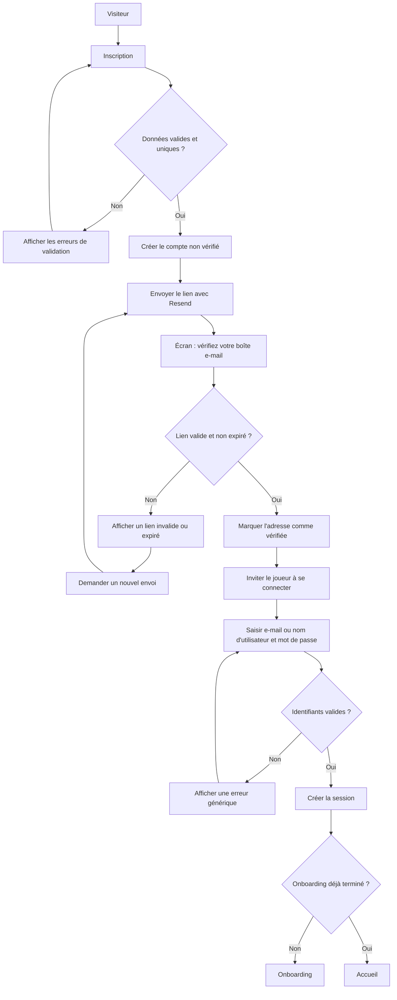

# HEIG Odyssey - Parcours de compte, vérification et sessions

| Élément | Valeur |
|---|---|
| Tâche | T-US01-01 |
| User story parente | US-01 |
| Nature | Fonctionnel / Sécurité |
| Estimation | 1 h / 2 h / 3 h |
| Statut attendu | Décisions prêtes à être implémentées dans T-US01-02 |

## 1. Objectif

Définir le parcours d'inscription et de connexion de HEIG Odyssey, les états possibles d'un compte, les règles de vérification de l'adresse e-mail et les contraintes de session.

Ce document sert de contrat fonctionnel pour l'intégration de Better Auth, Prisma et Resend. La récupération du compte et la réinitialisation du mot de passe relèvent de US-02.

## 2. Décisions fonctionnelles

### 2.1 Création du compte

L'inscription demande quatre valeurs :

- un nom d'utilisateur ;
- une adresse e-mail ;
- un mot de passe ;
- la confirmation du mot de passe.

Le nom d'utilisateur est unique et sert à la fois d'identifiant alternatif de connexion et de nom affiché dans le MVP. L'application conserve sa forme d'affichage, tandis que sa valeur de comparaison est normalisée en minuscules.

Les contraintes retenues sont les suivantes :

- entre 3 et 30 caractères ;
- lettres non accentuées, chiffres, point et tiret bas uniquement ;
- caractère `@` interdit afin d'éviter toute ambiguïté avec une adresse e-mail ;
- comparaison insensible à la casse : `KimPossible` et `kimpossible` désignent le même identifiant ;
- modification du nom d'utilisateur hors périmètre du MVP.

Le champ `name` exigé par Better Auth conserve le nom d'utilisateur affiché. Le champ `username` du plugin Username stocke sa forme normalisée et unique ; le champ redondant `displayUsername` est désactivé.

### 2.2 Vérification de l'adresse e-mail

L'adresse e-mail doit être vérifiée avant toute connexion. Après l'inscription :

1. le compte est créé dans l'état `EMAIL_NON_VERIFIE` ;
2. Resend envoie un lien de vérification à usage unique ;
3. le lien expire après 1 heure ;
4. un lien valide fait passer le compte à l'état `ACTIF` ;
5. le joueur est invité à se connecter, sans création automatique de session.

Un nouveau lien peut être demandé. La réponse affichée reste générique afin de ne pas révéler si une adresse est enregistrée.

### 2.3 Connexion dans un champ unique

L'écran de connexion contient un seul champ intitulé **Adresse e-mail ou nom d'utilisateur**, accompagné du mot de passe.

Le client transmet une valeur `identifier`. La couche d'authentification applique la règle suivante :

1. supprimer les espaces situés au début et à la fin ;
2. si la valeur possède le format d'une adresse e-mail, utiliser la connexion Better Auth par e-mail ;
3. sinon, normaliser la valeur en minuscules et utiliser la connexion Better Auth par nom d'utilisateur ;
4. présenter le même message d'échec dans les deux cas.

Better Auth fournit deux opérations distinctes, `signIn.email` et `signIn.username`. Le champ unique est donc une décision d'interface : une fonction applicative choisit l'opération appropriée sans exposer cette distinction au joueur.

Le message d'échec est :

> Adresse e-mail, nom d'utilisateur ou mot de passe incorrect.

Il ne doit pas permettre de déterminer si un compte existe, si son e-mail n'est pas vérifié ou si le mot de passe est erroné. Une indication spécifique sur la vérification peut être proposée uniquement après une preuve suffisante d'identité ou via le parcours sécurisé de renvoi d'e-mail.

### 2.4 Mot de passe

- longueur minimale : 8 caractères ;
- longueur maximale : 128 caractères ;
- aucune règle de composition artificielle n'est imposée dans le MVP ;
- le mot de passe n'est jamais journalisé ni stocké en clair ;
- les deux valeurs saisies à l'inscription doivent être identiques.

### 2.5 Session

- durée maximale sans renouvellement : 7 jours ;
- renouvellement glissant au plus tôt après 1 jour d'activité ;
- session stockée côté serveur et identifiée par un cookie sécurisé ;
- cookie `HttpOnly`, `Secure` en production et `SameSite=Lax` ;
- déconnexion : invalidation de la session active puis suppression du cookie ;
- absence ou invalidité de la session : accès refusé aux routes protégées ;
- un joueur connecté ne peut pas accéder aux écrans de connexion et d'inscription ;
- aucune donnée de session sensible n'est placée dans le navigateur.

## 3. États fonctionnels du compte

| État | Signification | Actions autorisées |
|---|---|---|
| `INEXISTANT` | Aucun compte ne correspond aux informations fournies. | Inscription et demande de récupération générique. |
| `EMAIL_NON_VERIFIE` | Compte créé, mais adresse e-mail non confirmée. | Vérification et demande d'un nouveau lien. Aucun accès au jeu. |
| `ACTIF` | Adresse vérifiée et compte utilisable. | Connexion, déconnexion et accès aux fonctionnalités autorisées. |
| `SESSION_EXPIREE` | Compte actif, mais session absente, révoquée ou expirée. | Nouvelle connexion. |

Les états de suspension, de bannissement et de suppression du compte sont hors du MVP.

## 4. Parcours principal

## 5. Matrice d'accès et de redirection

| État du visiteur | Route publique d'authentification | Route protégée | Après connexion |
|---|---|---|---|
| Non connecté | Accès autorisé. | Redirection vers la connexion avec une destination de retour sûre. | Onboarding si nécessaire, sinon accueil. |
| E-mail non vérifié | Accès à l'écran d'attente et au renvoi du lien. | Accès refusé. | Connexion refusée sans révéler plus d'informations que nécessaire. |
| Connecté | Redirection vers l'accueil. | Accès autorisé. | Sans objet. |
| Session expirée ou invalide | Accès autorisé. | Session supprimée puis redirection vers la connexion. | Nouvelle session après authentification. |

La destination de retour doit être interne à l'application et validée afin d'empêcher une redirection vers un site externe.

## 6. Comportement attendu par action

### Inscription

- Valider le format de l'e-mail, le nom d'utilisateur, la longueur du mot de passe et sa confirmation.
- Refuser un nom d'utilisateur ou une adresse e-mail déjà utilisés.
- Ne pas créer de session avant la vérification de l'adresse e-mail.
- Déclencher l'e-mail de vérification après la création du compte.
- Retourner une réponse non révélatrice lorsqu'une adresse existe déjà, conformément aux protections de Better Auth.

### Vérification

- Accepter un jeton valide une seule fois.
- Refuser un jeton expiré, altéré ou déjà consommé.
- Ne pas inclure de donnée sensible dans l'URL ni dans les journaux.
- Proposer le renvoi d'un lien soumis à une limitation de fréquence.

### Connexion

- Accepter une adresse e-mail ou un nom d'utilisateur dans le même champ.
- Acheminer en interne vers la bonne opération Better Auth.
- Refuser la connexion avant la vérification de l'e-mail.
- Utiliser un message générique pour les identifiants invalides.
- Créer la session uniquement après une authentification complète.
- Rediriger vers l'onboarding ou l'accueil selon l'état du joueur.

### Déconnexion

- Invalider la session active côté serveur.
- Supprimer le cookie de session.
- Rediriger vers la page de connexion.

## 7. Messages fonctionnels

| Situation | Message affiché |
|---|---|
| Inscription acceptée | `Compte créé. Consultez votre boîte e-mail pour vérifier votre adresse.` |
| Vérification réussie | `Adresse vérifiée. Vous pouvez maintenant vous connecter.` |
| Lien invalide ou expiré | `Ce lien de vérification est invalide ou a expiré. Demandez-en un nouveau.` |
| Renvoi demandé | `Si cette adresse correspond à un compte, un nouveau lien a été envoyé.` |
| Connexion refusée | `Adresse e-mail, nom d'utilisateur ou mot de passe incorrect.` |
| Session expirée | `Votre session a expiré. Connectez-vous à nouveau.` |

Les messages techniques, traces d'exception et détails internes ne sont jamais affichés au joueur.

## 8. Contraintes de sécurité

- Utiliser les mécanismes de hachage, de jetons et de sessions fournis par Better Auth.
- Activer la limitation de fréquence sur l'inscription, la connexion, la vérification et le renvoi d'e-mail.
- Ne pas exposer de route publique permettant de tester librement l'existence d'un e-mail ou d'un nom d'utilisateur.
- Comparer les noms d'utilisateur sous leur forme normalisée.
- Valider les entrées côté serveur même si elles ont déjà été validées dans l'interface.
- Ne jamais placer de secret, de jeton complet, de mot de passe ou de contenu de cookie dans les logs.
- Charger les secrets Better Auth et Resend depuis les variables d'environnement et GitHub Actions Secrets.
- Autoriser seulement les origines approuvées par l'application.
- Utiliser HTTPS en production.

## 9. Écrans nécessaires

| Écran | État dans les maquettes | Adaptation ou complément nécessaire |
|---|---|---|
| Inscription | Présent. | Préciser que le nom d'utilisateur est unique et afficher les erreurs par champ. |
| Connexion | Présent. | Renommer le champ en `Adresse e-mail ou nom d'utilisateur`. |
| Attente de vérification | Absent. | Ajouter un message d'envoi, un bouton de renvoi et un retour vers la connexion. |
| Résultat de vérification | Absent. | Ajouter les variantes succès, lien invalide et lien expiré. |
| Mot de passe oublié | Présent, rattaché à US-02. | Conserver uniquement l'adresse e-mail : elle est nécessaire pour recevoir le lien de récupération. |
| Réinitialisation | Présent, rattaché à US-02. | Gérer jeton valide, expiré et déjà consommé. |

## 10. Scénarios d'acceptation

| ID | Scénario | Résultat attendu |
|---|---|---|
| AUTH-01 | Inscription avec des données valides et uniques. | Le compte non vérifié est créé et l'e-mail est demandé à Resend. |
| AUTH-02 | Inscription avec une adresse e-mail mal formée. | La requête est refusée et le champ concerné est signalé. |
| AUTH-03 | Inscription avec un nom d'utilisateur déjà utilisé, quelle que soit la casse. | La requête est refusée sans créer de second compte. |
| AUTH-04 | Inscription avec un nom d'utilisateur contenant `@` ou un caractère interdit. | La requête est refusée avec une erreur de validation du champ. |
| AUTH-05 | Inscription avec deux mots de passe différents. | La requête est refusée sans créer de compte. |
| AUTH-06 | Ouverture d'un lien de vérification valide. | L'e-mail est marqué comme vérifié et aucune session automatique n'est créée. |
| AUTH-07 | Ouverture d'un lien expiré, altéré ou déjà consommé. | La vérification échoue et un nouveau lien peut être demandé. |
| AUTH-08 | Connexion avec l'adresse e-mail vérifiée et le bon mot de passe. | Une session est créée. |
| AUTH-09 | Connexion avec le nom d'utilisateur et le bon mot de passe. | La même session est créée que pour une connexion par e-mail. |
| AUTH-10 | Connexion avec un identifiant inconnu ou un mauvais mot de passe. | Le même message générique est affiché dans tous les cas. |
| AUTH-11 | Connexion avant la vérification de l'adresse e-mail. | Aucun accès au jeu et aucune session exploitable. |
| AUTH-12 | Accès à une route protégée sans session. | Redirection vers la connexion. |
| AUTH-13 | Accès à une route protégée avec une session valide. | Accès autorisé. |
| AUTH-14 | Accès à une route d'authentification en étant connecté. | Redirection vers l'accueil. |
| AUTH-15 | Déconnexion. | Session invalidée, cookie supprimé et accès protégé refusé. |
| AUTH-16 | Expiration ou révocation de session pendant la navigation. | Retour contrôlé vers la connexion, sans fuite de données. |

## 11. Conséquences pour T-US01-02

L'intégration devra notamment :

- activer le plugin Username côté serveur et son client Better Auth ;
- générer puis appliquer le schéma Better Auth compatible avec Prisma ;
- prévoir les champs uniques `email` et `username`, ainsi que la valeur d'affichage retenue ;
- implémenter une fonction de connexion qui distribue le champ unique vers `signIn.email` ou `signIn.username` ;
- configurer l'envoi de vérification avec Resend ;
- appliquer `requireEmailVerification` ;
- configurer l'expiration et le renouvellement des sessions ;
- conserver un message d'erreur commun pour les deux méthodes de connexion.

La génération officielle du schéma Better Auth doit être privilégiée afin d'éviter de deviner manuellement les colonnes nécessaires au plugin.

## 12. Références techniques

- [Better Auth - Email & Password](https://better-auth.com/docs/authentication/email-password)
- [Better Auth - Username](https://better-auth.com/docs/plugins/username)
- [Better Auth - Session Management](https://better-auth.com/docs/concepts/session-management)
- [Better Auth - Cookies](https://better-auth.com/docs/concepts/cookies)
- [Better Auth - Rate Limit](https://better-auth.com/docs/concepts/rate-limit)
- [Better Auth - Security](https://better-auth.com/docs/reference/security)
